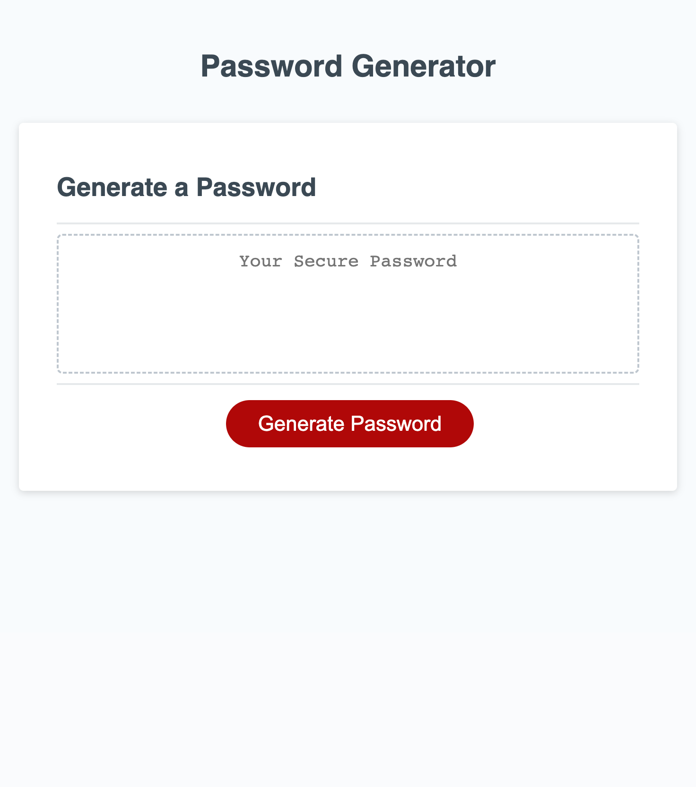

# Challenge-3-Javascript-Password-Generator

## Description

This is a password generator aimed at employees handling sensitive data. With a click, it prompts you to set password criteria, including length (between 8 and 128 characters) and character types (lowercase, uppercase, numeric, special). After validating your choices, it generates a secure password matching your specifications and presents it to you via an alert or directly on the webpage. This tool enhances your data security by creating strong, customized passwords.

## Usage

## Credits

Collaborated with Breakout Team 4; "Dream Team"! Leveraged partnerships to check for understanding.

Referenced Modzilla Web Development Blog and Code Source for additional guidance.

Tutor and Chat GPT validated code and help finalize after troubleshooting.

## License

MIT License in repository.

## URLs

URL of deployed website: https://mmerzoug.github.io/Challenge-3-Javascript-Password-Generator/

URL of Github Repository: https://github.com/MMerzoug/Challenge-3-Javascript-Password-Generator.git

---